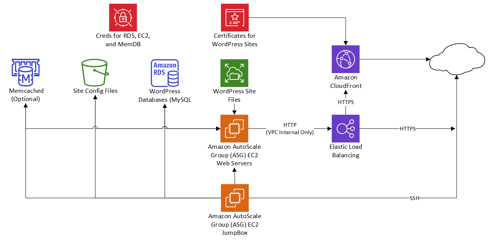

# Terraform - AWS AutoScaling Wordpress Infrastructure
This repo will build out AWS Infrastructure which will scale to the owner's needs. Will admit this is overkill for most WordPress sites but is a fun project to play with, and has potential to growth with very little work.

# Architecture Design

## Used Resources
| Resource | Description |
|----------|-------------|
| EC2 Auto Scaling Groups (ASG) | Used for creating and scaling EC2 (Apache) Web Servers and refreshing the JumpBox |
| Application Load Balancer (ALB) | Proxy to the Web Servers |
| Content Delivery Network (CDN) | Used as the caching and web security endpoint |
| Relational Database Service (RDS) | This hosts the MariaDB Databases for the WordPress sites |
| MemCached (ElastiCache) "Optional" | This provide additional caching for web queries on WordPress Servers. The Site config does have the option but have not added the TF code yet |
| Network File System (EFS) | Holds the WordPress site files |
| Object Storage (S3) | Holds the Configuration files needed for the Web Servers to serve the WordPress Sites |
| Certificate Manager (ACM) | This manages the certificates for the sites and is attached to the CDN. Another cert is currently generated with `wp.` prepended to the site name and attached to the Load Balancer but looking to use AWS's cert for this in the future |
| Secrets Manager | Holds the SSH keys for the EC2 instances and information for the RDS and MemDB instances |

## Notes on Architecture
* The web servers and DB are not accessable externally. They do have public IPs but the security group only allow access from within the Virtual Private Cloud (VPC) in AWS. This is the reason for the JumpBox. The public IPs are needed for installing and updating OS packages when the new nodes launch
* The connection from the load balancer to the web servers is unsecured port HTTP(80). This is noted as a security concern and is acceptable as the web servers are not accessable on port 80 outside the VPC. The load balancer, via HTTPS(443) is the only means for web traffic from the internet to the web servers. This is to allow ACM to manage the certificate without having to mess with the EC2 instances. Might change this up later, but leaving for now.
* Individuals outside can access the site from the CDN or the load balancer. Going through the load balancer takes work by the individual and the SSL will show as bad if it is done this way. This is expected as traffic should always go through the CDN. Having the load balancer available provides ability to troubleshoot caching issues with the CDN.
* The Instances used are "t4g" instances (ARM64) for there cost/performance. The AMI is the latest Amazon Linux 2023 ARM64 image and will update as updates occur.

# Usage
### Prerequisites
* Need `aws-cli/2.31.3` or higher
* Need `Terraform v1.13.3` or Higher
* Make sure you can connect to your AWS acount with AWS CLI.
* Make an S3 bucket where your Terraform state file will reside
* If you are using a custom cert, ensure it is in ACM (Amazon certificate Manager) in us-east-1. You will need the arn.

### Steps
1. Update [backend.tf](backend.tf) with your S3 bucket for storing Terraform States and the file name for the state file.
2. Update [variables.tf](variables.tf) to the needs of your project or use ENV varaiables.
3. If you are having Amazon make the Cert. set the [cert_validated] variable to false on the first run. This will build everything but the Load Balancer's HTTPS listner and the CDN as they need a valid certificate. The output will provide you the DNS entry that needs to added to the domain to validate the cert.
4. From the root of your repo, run `terraform init`
5. Run `terraform plan` to see what changes
6. If all looks good, run `terraform apply` of you don't want the approve prompt us `-auto-approve` option.
7. If a new cert was made set the [cert_validated] back to true and repeat steps 5-6 to have the HTTPS and CDN built, completing the Infrastructure build.

# Terraform Setup
General Configs:
| File                          | description                                                                                   |
|-------------------------------|-----------------------------------------------------------------------------------------------|
|[backend.tf](backend.tf)       | Manages the Terraform providers for the project and the State file in the S3                  |
|[data.tf](data.tf)             | Provides default AWS network information for other resources                                  |
|[variables.tf](variables.tf)   | Provides project variables for resource names and tags                                        |
|[locals.tf](locals.tf)         | used to generate dynamic config files and scripts for the web servers                         |
|[outputs.tf](outputs.tf)       | provides output if formation back out for things like DNS updates, what AMI is in play etc    |

Resource Configs:
| File                                  | description                                                                                   |
|---------------------------------------|-----------------------------------------------------------------------------------------------|
|[ssh.tf](ssh.tf)                       | Manages the SSH KeyPair used for the Jump Box and the Web Servers. It generates the KeyPair and adds it into the AWS Secrets Manager |
|[efs.tf](efs.tf)                       | To ensure all the web servers have the same site files, this config manages the Elastic File System (EFS) network storage which is mounted to all the web servers and the jump box |
|[jumpbox.tf](jumpbox.tf)               | This manages the jump box through ASG. The jump box is the only way to get into the web servers operating system and the RDS database |
|[web_servers.tf](web_servers.tf)       | This manages the web servers through ASG and references the load balancer which the web servers are behind |
|[alb.tf](alb.tf)   | This manages the Application Load Balancer |
|[cdn.tf](cdn.tf)         | Manages the CDN and caching |
|[certificates.tf](certificates.tf)     | The project uses Amazon Certificate Manager (it's free). This config creates any needed certificates for the Dragon |Solutions domain |
|[s3.tf](s3.tf)                         | Manages the site config bucket usedby web servers to get needed files for launching the website |
|[rds.tf](rds.tf)                       | Manages the RDS Instance (MySQL) for the sites |
|[script_file](script_files)            | folder that hold the common static files needed for launching the setup sites |

# Notes
* This does not include backup operations... yet
* If RDS replicas are used, there is no Load balancer for them, will need to work on a load balancer for the DBs if replicas are used.
* As ASGs are used, am unable to get the public IP of the JumpBox. Will need to log into AWS and see the IP from the EC2 console.
* This only creates the initial domain name. Looking at adding additional domain names to this.

# Notes and References
Tutorial for WordPress on Amazon Linux 2023
https://docs.aws.amazon.com/linux/al2023/ug/hosting-wordpress-aml-2023.html

WordPress Settings for behind AWS ALB
https://developer.wordpress.org/reference/functions/is_ssl/

Security CDN to Load Balancer. I've held off on using this as this would block the ability to troubleshoot caching by bypassing the CDN and going straight to the Load Balancer.
https://www.logan-cox.com/posts/secure_alb/

Caching using CloudFront for Wordpress. This was used as a starting point for CDN caching.
https://blog.ymirapp.com/wordpress-page-caching-cloudfront/

Amazon Linux 2023 does not include php-imagcik module for an install for it which WordPress would really like. This is hoy to make the module. The is built every time a new web server node is launched.
https://blog.ultranurd.net/2024/11/17/installing-php-imagemagick-on-amazon-linux-2023/

creating databases in RDS instance after the instance is created:
https://medium.com/railsfactory/terraform-mastery-adding-databases-to-rds-instances-effortlessly-fb18c908dd0b
